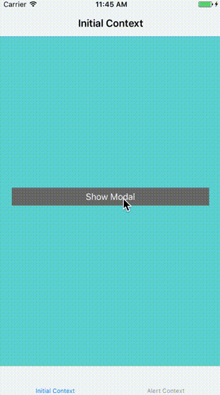

# FunWithEnums



Use _enums_ to define (and _inject_) your application's state:

```swift
enum AppViewState {
    case tabs(AppContext)
    case modal(AppContext)
    case alert(AppContext, title: String, message: String, actions: [UIAlertAction]?)
    case unknown
}
```

Easily transition to a new state:  

```swift
context.proceed(to: .tabs(context))
```

A transition is represented as a `AppTransition`:

```swift
enum AppTransition {
    case present(UIViewController)
    case set([UIViewController])
}
```

